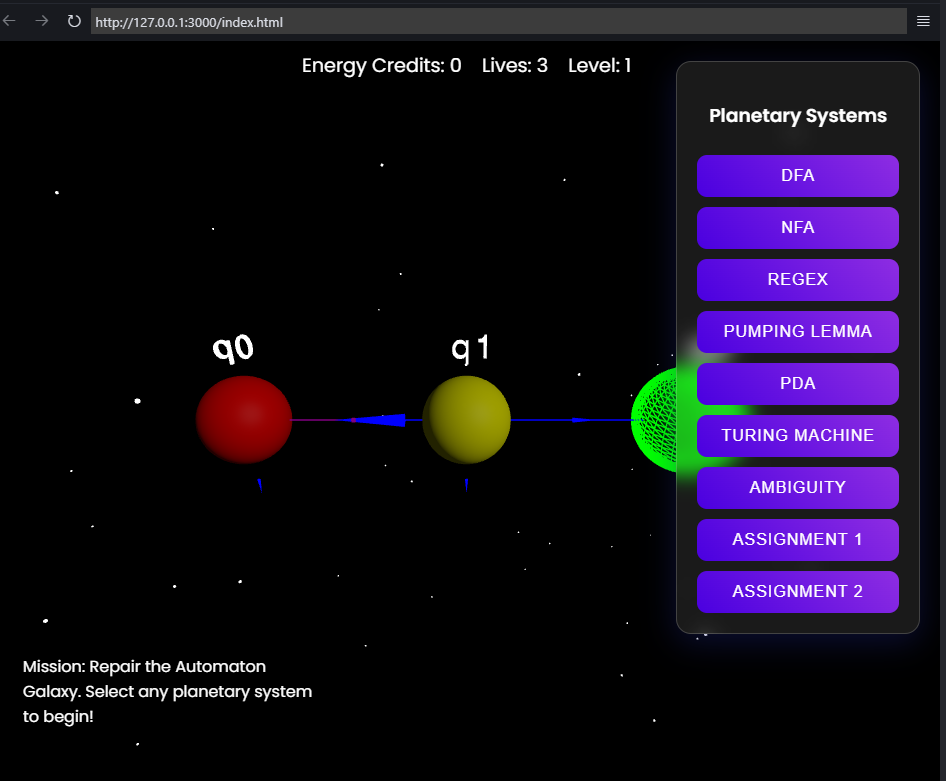

## Overview

# Game Automata

A tool for automating game interactions through image recognition and scripting.



## Overview

This project uses computer vision and automation techniques to interact with games programmatically. By analyzing screenshots and game state, it can perform automated actions based on visual input.

## Features

- Image recognition for game state detection
- Automated input simulation
- Configurable action scripts
- Screenshot analysis capabilities

## Setup

1. Clone the repository:
```bash
git clone https://github.com/yourusername/game-automata.git
```
2. Install dependencies:
```bash
npm install
```

## Usage

1. Start the application:
```bash
npm start
```

2. Open your web browser and navigate to `http://localhost:3000`

3. Configure your automation settings in the interface

4. Select the game window you want to automate

5. Run your automation scripts

## Contributing

Contributions are welcome! Please feel free to submit a Pull Request.

## License

This project is licensed under the MIT License - see the LICENSE file for details.
```
